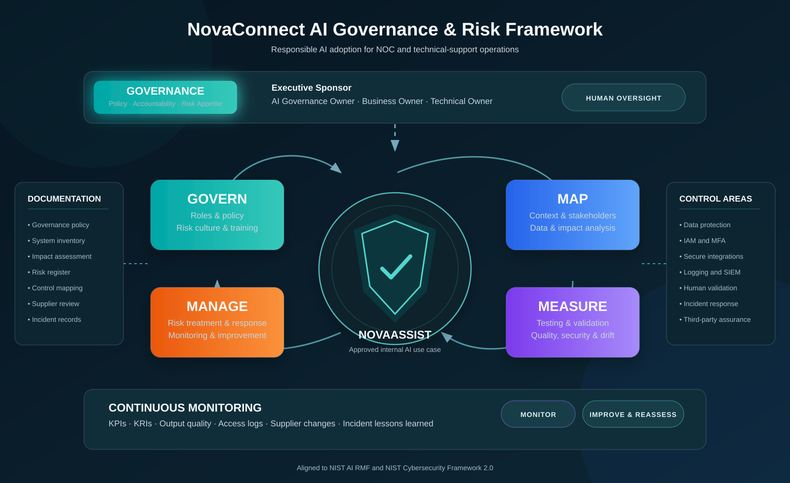

# AI Governance & Risk Management Framework

> A practical, portfolio-ready AI governance and cybersecurity risk-management framework for an internal generative AI assistant supporting NOC and technical-support operations.



## Overview

This repository demonstrates how an organization can govern, assess, secure, monitor, and improve an internal AI system.

The fictional organization, **NovaConnect Services**, plans to use **NovaAssist**, a generative AI assistant that supports NOC and technical-support teams with ticket summarization, troubleshooting guidance, knowledge retrieval, documentation drafting, and operational workflow support.

The project is designed as a practical governance portfolio. It combines AI governance, cybersecurity, privacy, third-party risk management, incident response, monitoring, and regulatory awareness into one reusable framework.

## Scope

### In scope

- Internal AI-assisted NOC and technical-support workflows
- Human-reviewed ticket summaries and knowledge retrieval
- AI-supported troubleshooting recommendations
- Internal documentation drafting
- Approved integrations with operational systems
- Security, privacy, supplier, operational, and reputational risks

### Out of scope

- Autonomous production changes
- Unreviewed customer-facing communications
- Automated hiring, employment, credit, insurance, housing, healthcare, education, or legal decisions
- Processing of credentials, secrets, private keys, payment-card data, or unnecessary regulated data
- Any use case that makes or materially influences consequential decisions without a separate risk and legal review

## Framework Design

The framework combines:

- **NIST AI RMF:** Govern, Map, Measure, and Manage
- **NIST Cybersecurity Framework 2.0:** Govern, Identify, Protect, Detect, Respond, and Recover
- **ISO/IEC 42001 concepts:** AI management-system governance, lifecycle controls, performance evaluation, and continual improvement
- **Privacy and regulatory considerations:** GDPR, EU AI Act, and Colorado SB24-205 relevance screening
- **Third-party risk management:** supplier due diligence, contractual safeguards, assurance evidence, and change management

## Governance Principles

1. **Human accountability:** AI assists employees; accountable people make final operational decisions.
2. **Risk-based adoption:** Higher-risk use cases receive deeper review, testing, controls, and approval.
3. **Data minimization:** Only data necessary for an approved purpose may be processed.
4. **Secure by design:** Identity, access, logging, encryption, integration security, and supplier assurance are baseline requirements.
5. **Transparency:** Users must understand the AI system’s purpose, limits, and required review responsibilities.
6. **Continuous monitoring:** KPIs, KRIs, quality sampling, incidents, and supplier changes inform ongoing improvement.
7. **No uncontrolled expansion:** New data, integrations, user groups, autonomous capabilities, or customer-facing workflows require reassessment.

## Repository Structure

```text
.
├── README.md
├── assets/
│   └── framework-diagram.svg
├── docs/
│   ├── 01-project-charter.md
│   ├── 02-ai-governance-policy.md
│   ├── 03-ai-system-inventory.md
│   ├── 04-ai-impact-assessment.md
│   ├── 05-ai-risk-register.md
│   ├── 06-control-mapping.md
│   ├── 07-third-party-risk-assessment.md
│   ├── 08-ai-incident-response-plan.md
│   ├── 09-monitoring-and-kpis.md
│   └── 10-regulatory-crosswalk.md
└── templates/
    ├── ai-use-case-intake-form.md
    ├── ai-impact-assessment-template.md
    ├── ai-risk-register-template.csv
    ├── supplier-ai-questionnaire.md
    └── ai-incident-report-template.md
```

## Documentation

| Document | Purpose |
|---|---|
| [Project Charter](docs/01-project-charter.md) | Defines project purpose, scope, objectives, stakeholders, and success criteria |
| [AI Governance Policy](docs/02-ai-governance-policy.md) | Establishes governance principles, roles, approval requirements, and acceptable use |
| [AI System Inventory](docs/03-ai-system-inventory.md) | Documents the NovaAssist system, data, integrations, users, controls, and lifecycle status |
| [AI Impact Assessment](docs/04-ai-impact-assessment.md) | Evaluates intended use, stakeholder impacts, privacy, security, reliability, and human oversight |
| [AI Risk Register](docs/05-ai-risk-register.md) | Records AI risks, controls, owners, treatment actions, and residual risk |
| [Control Mapping](docs/06-control-mapping.md) | Maps controls to NIST AI RMF, NIST CSF 2.0, ISO/IEC 42001, and operational evidence |
| [Third-Party Risk Assessment](docs/07-third-party-risk-assessment.md) | Evaluates AI provider security, privacy, resilience, contractual, and supply-chain risks |
| [AI Incident Response Plan](docs/08-ai-incident-response-plan.md) | Defines AI incident detection, triage, containment, recovery, communication, and lessons learned |
| [Monitoring and KPIs](docs/09-monitoring-and-kpis.md) | Defines KPIs, KRIs, sampling, monitoring sources, reporting, and escalation criteria |
| [Regulatory Crosswalk](docs/10-regulatory-crosswalk.md) | Connects framework controls to selected standards and regulatory concepts |

## Reusable Templates

| Template | Purpose |
|---|---|
| [AI Use Case Intake Form](templates/ai-use-case-intake-form.md) | Captures proposed use cases, users, data, risks, human oversight, and required reviews |
| [AI Impact Assessment Template](templates/ai-impact-assessment-template.md) | Supports consistent assessment of AI impacts before deployment or material change |
| [AI Risk Register Template](templates/ai-risk-register-template.csv) | Provides a structured CSV format for tracking AI risks and treatment actions |
| [Supplier AI Questionnaire](templates/supplier-ai-questionnaire.md) | Supports vendor due diligence for AI security, privacy, governance, and contractual requirements |
| [AI Incident Report Template](templates/ai-incident-report-template.md) | Supports consistent recording, investigation, recovery, and follow-up of AI incidents |

## Lifecycle Workflow

```text
1. Submit an AI use-case intake form
2. Classify the proposed use case and data sensitivity
3. Complete security, privacy, legal, and supplier reviews as required
4. Conduct an AI impact assessment
5. Record and treat risks in the AI risk register
6. Define controls, testing requirements, and human oversight
7. Obtain documented approval before deployment
8. Monitor quality, security, access, incidents, and provider changes
9. Reassess after material changes, incidents, or scope expansion
10. Improve controls, documentation, training, and governance continuously
```

## Roles

| Role | Core Responsibility |
|---|---|
| Executive Sponsor | Sets direction, resources, and risk tolerance; approves material residual risk |
| AI Governance Owner | Maintains framework, coordinates reviews, tracks risk, and reports governance outcomes |
| Business Owner | Defines business purpose, validates value, and ensures operational accountability |
| Technical Owner | Manages architecture, integrations, configuration, and technical controls |
| Information Security | Assesses threats, access, logging, vulnerabilities, incidents, and security controls |
| Privacy / Legal / Compliance | Reviews privacy, contractual, legal, and regulatory obligations |
| Procurement / Third-Party Risk | Conducts supplier due diligence and manages contractual requirements |
| NOC and Technical Support Operations | Validates output quality, performs human review, reports issues, and follows approved workflows |
| Authorized Users | Use AI only for approved purposes, protect data, validate outputs, and report incidents |

## Risk Tiers

| Risk Level | Typical Characteristics | Required Governance |
|---|---|---|
| Low | Internal, low-sensitivity data; no autonomous action; limited operational impact | Intake review, documented owner, baseline controls |
| Medium | Internal or confidential data; operational reliance; external provider or integrations | Impact assessment, security review, monitoring plan, documented approval |
| High | Sensitive data, broad integrations, customer-facing impact, or elevated operational consequences | Cross-functional review, enhanced testing, executive approval, stronger monitoring |
| Critical | Consequential decisions, high-risk regulated data, privileged autonomous action, or severe potential harm | Not permitted without dedicated legal, executive, security, privacy, and governance approval |

## Key Control Areas

- Identity, authentication, authorization, RBAC, and MFA
- Least privilege and periodic access reviews
- Data classification, minimization, encryption, retention, and deletion
- Secure APIs, integration scoping, secret management, and logging
- Human review for material operational or external-facing outputs
- Prompt-injection and adversarial-input testing
- Output-quality sampling, monitoring, and drift detection
- Provider due diligence, contractual safeguards, and material-change management
- Incident response, recovery validation, and lessons learned
- Training and approved-use enforcement

## Reassessment Triggers

A new intake, impact assessment, or approval review is required when there is:

- A new AI provider, model, integration, plugin, or autonomous capability
- A material change in system purpose, user group, data type, or workflow
- Introduction of customer-facing content or consequential decision support
- A security, privacy, quality, availability, or policy incident
- A material provider change involving data use, retention, hosting, subprocessors, or security posture
- A change in law, regulation, contract, customer requirement, or organizational risk tolerance
- Sustained KPI degradation or a KRI threshold breach

## Standards and References

- [NIST Artificial Intelligence Risk Management Framework](https://airc.nist.gov/airmf-resources/airmf/)
- [NIST AI RMF Playbook](https://airc.nist.gov/airmf-resources/playbook/)
- [NIST Cybersecurity Framework 2.0](https://doi.org/10.6028/NIST.CSWP.29)
- [NIST Cybersecurity Framework 2.0 Reference Tool](https://csrc.nist.gov/projects/cybersecurity-framework/filters)
- [ISO/IEC 42001:2023](https://www.iso.org/standard/81230.html)
- [NIST Privacy Framework](https://www.nist.gov/privacy-framework)
- [NIST SP 800-161r1: Cybersecurity Supply Chain Risk Management](https://csrc.nist.gov/pubs/sp/800/161/r1/final)

## Disclaimer

This repository is an educational and portfolio project. It provides example governance artifacts and is not legal advice, a compliance certification, a substitute for a formal risk assessment, or a complete security architecture.

Organizations should tailor all controls, risk decisions, contractual requirements, privacy practices, and regulatory analyses to their specific jurisdiction, business model, systems, data, and risk tolerance.

## License

This project is provided for educational and portfolio purposes. Adapt it responsibly for your organization’s needs.
